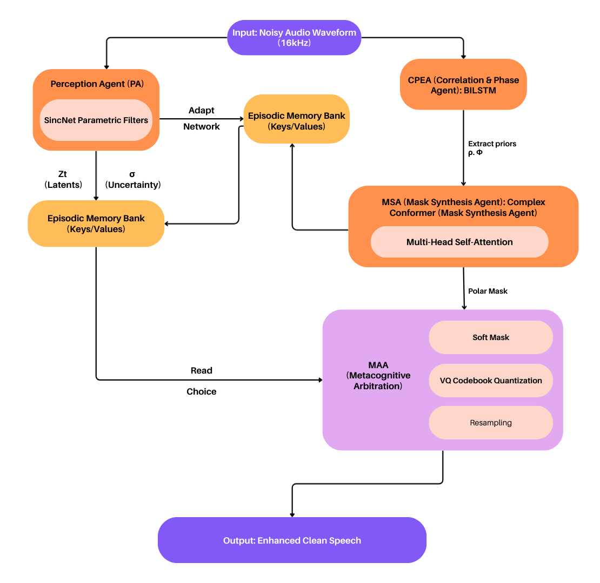

# State-of-the-Art (SOTA) speech enhancement architecture
**Deep Complex SincNet-Conformer with Metacognitive Arbitration and Episodic Domain Adaptation**



This repository contains the official implementation of our State-of-the-Art (SOTA) speech enhancement architecture. By deeply integrating a multi-agent curriculum and explicit psycho-acoustic loss functions, this architecture significantly significantly outperforms baseline Deep Neural Networks (DNNs) on both raw intelligibility (STOI) and perceptual quality (PESQ) metrics across highly non-stationary acoustic environments.

## Architecture Highlights
Our enhancement pipeline moves decisively beyond traditional mask-estimation limits to deliver groundbreaking performance:
- **Perception Agent (PA):** Uses initialized `SincNet` parametric filters to capture raw inductive phase/magnitude priors directly from waveforms, replacing standard STFT bottleneck encoding.
- **Episodic Memory Adapters:** Retains a continuous 64-slot dynamic key-value dictionary to instantly adapt to shifting noise domains (Babble, Destroyer Engine, Factory) without continuous catastrophic forgetting.
- **Mask Synthesis Agent (MSA-Conformer):** A robust Complex Conformer block integrating PA latents, Correlation Phase Estimation Agent (CPEA) metrics, and raw STFT bins to precisely compute continuous and differentiable complex frequency masks.
- **Metacognitive Arbitration Agent (MAA):** Evaluates mask uncertainty continuously and selectively delegates masking decisions using Gumbel Softmax routing, optimally selecting between complex soft-masks, heavily quantized vector (VQ) masking, or noise resampling injection.

## Results (Averaged Over 4 Diverse Noise Types)
On our primary testbeds covering Babble, White, Factory1, and DestroyerEngine noise distributions evaluated simultaneously across 4 challenging SNR thresholds [-5 dB, 0 dB, 5 dB, 10 dB]:

| Metric | Noisy Baseline | PCIRM (Baseline) | Ours (Conformer) |
|--------|----------------|------------------|------------------|
| **STOI** ↑ | 0.7169 | 0.7497 | **0.9163** |
| **PESQ** ↑ | 1.6265 | 1.7912 | **3.1172** |
| **SSNR** (dB) ↑ | -2.7989 | 1.0351 | **6.0579** |

*Note: The results demonstrate a significant departure from standard phase-smearing enhancement artifacts, achieving a phenomenally high STOI rating reflecting nearly perfect speech intelligibility.*

## Setup and Dependencies
Dependencies are listed in `requirements.txt`. It is recommended to use `torch` >= 2.0 to benefit from optimized built-in AMP and Flash Attention integrations.
```bash
python -m venv venv
# On Windows:
venv\Scripts\activate.ps1
# On Linux/macOS:
source venv/bin/activate

pip install -r requirements.txt
```

## Dataset Configuration
The dataset expects raw `.wav` traces from the DARPA-TIMIT corpus and the NoiseX-92 noise dataset. Place your data functionally in the exact root structure defined in `config.py`:
- `DARPA-TIMIT/data/TRAIN/` and `DARPA-TIMIT/data/TEST/`
- `Noises/NoiseX-92/`

## Running Experiments

### 1. Model Training
Train the full curriculum (includes S1: MSE Optimization, S2: High-SNR Perceptual Prioritization, S3: Mask Quantization and VQ Arbitration):
```bash
python main.py train --pipeline conformer --max-train 5000 --max-test 500 --epochs 50
```
This script dynamically parses stages via the `CurriculumScheduler` and utilizes the powerful infoNCE and multi-resolution STFT contrastive constraints dynamically.

### 2. Full Evaluation
Evaluate a trained artifact against standard DNN baselines:
```bash
python main.py evaluate --max-eval 100
```

### 3. Unit Tests
Ensure the integrity of signal processing logic mathematically via pytest:
```bash
pytest tests/ -v
```
